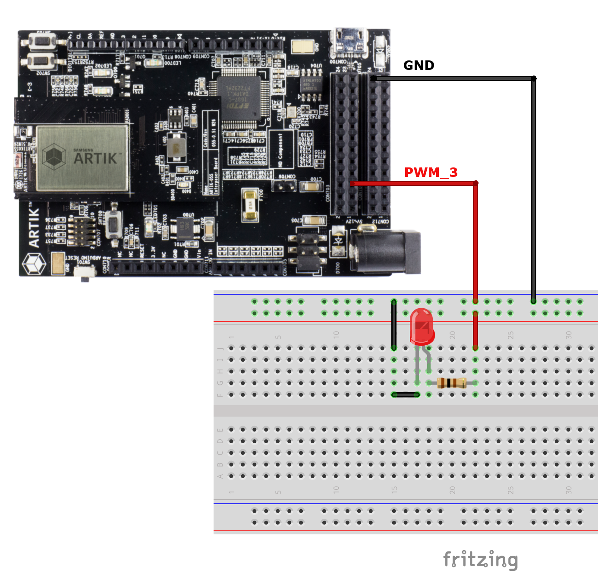

# Smart Lighting Control with ARTIK 055S

[](LICENSE)

This application is to use ARTIK 055S to implement smart dimmable light.  The smart light application can be used with Samsung ARTIK mobile app to turned on, turn off and/or adjusting brightness of the light.  A physical on device button is also provided for a more traditional way of controlling light.  By using Samsun ARTIK mobile app, users can easily onboard the smart light onto ARTIK Cloud.  Over the air firmware update (OTA) capability is included in the smart light application as well. 

## Contents

> * [Prepare Hardware](#prepare-hardware)
> * [About Smart Light application](#about-smart-light-application)
> * [Build Application](#build-application)
> * [Program Binary](#program-binary)
> * [Run Smart Light application](#run-smart-light-application)
> * [Generate OTA Image](#generate-ota-image)

## Prepare Hardware

Connect LED to ARTIK 055S like shown below:

The ARTIK 055S starter kit pin out map is listed [here](../../../build/configs/artik055s/README.md#artik055s-starter-kit-pinout).

## About Smart Light Application


## Build Application
Refer [here](../../../README.md#ubuntu-development-setting) to setup development environment.
```bash
$ cd os
$ ./tools/configure.sh artik055s/typical
$ make
```

## Program Binary
```bash
$ make download ALL
```

## Run Smart Light application
```bash
TASH>> smartlight
```
Then refer to [artik.io](https://developer.artik.io/documentation/artik-05x/getting-started/communicate.html#auto-connect-artik-05x-to-wi-fi-and-artik-cloud) for detail instruction of how to connect ARTIK055S powered smart light device to Wi-Fi and ARTIK Cloud.
 
## Generate OTA Image
```bash
$ make image ota
```
Note: The resulting "ota.bin" can be found under **/build/configs/$(BOARD_NAME)/bin**  
This image can be used to upload into [ARTIK Cloud](https://developer.artik.cloud/documentation/device-management/ota-updates.html) for OTA update under device management. 


Enjoy!

